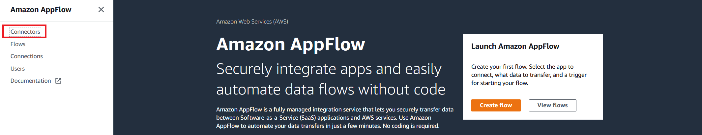
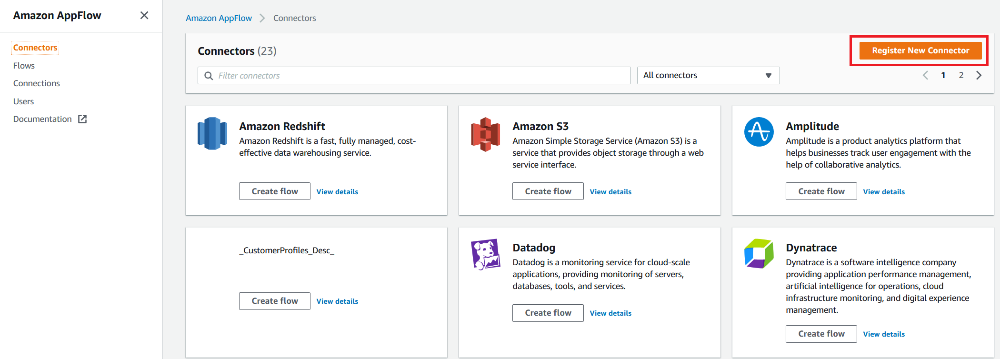
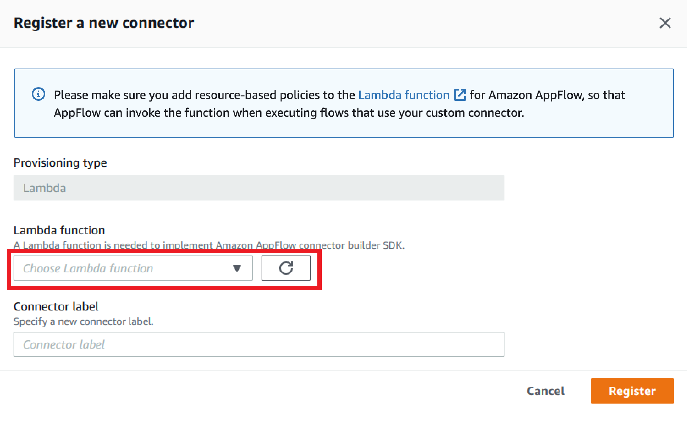
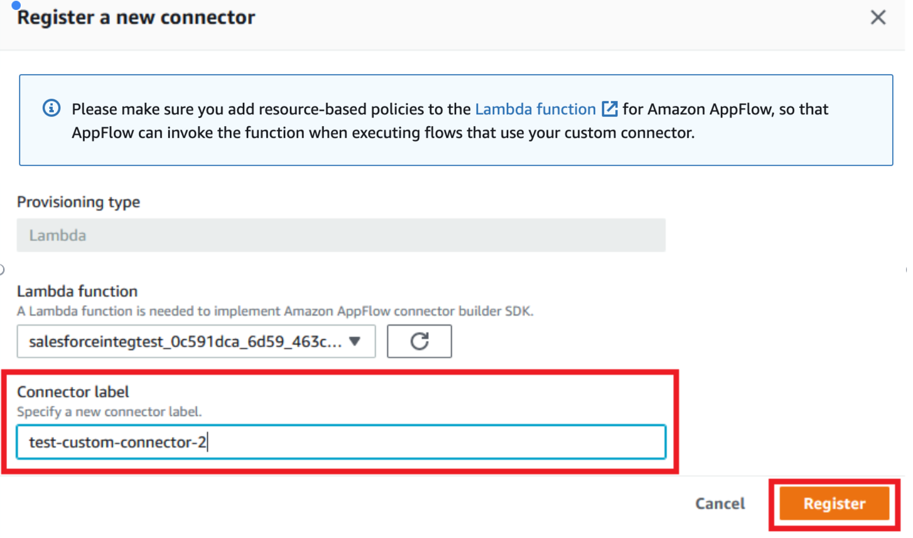
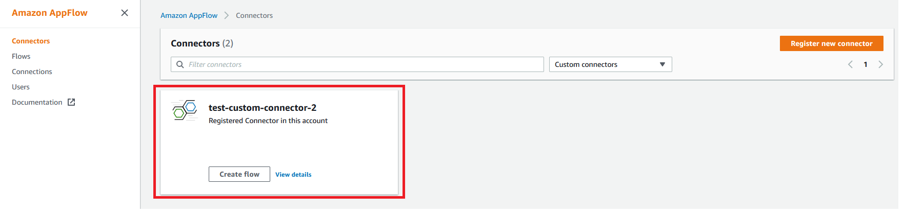
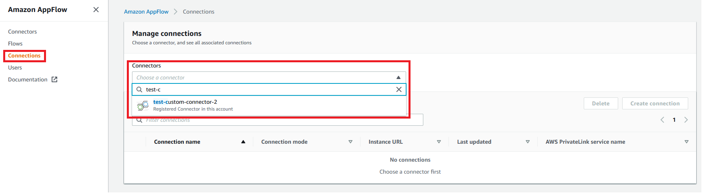
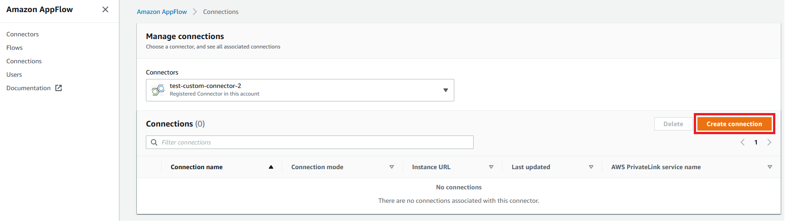
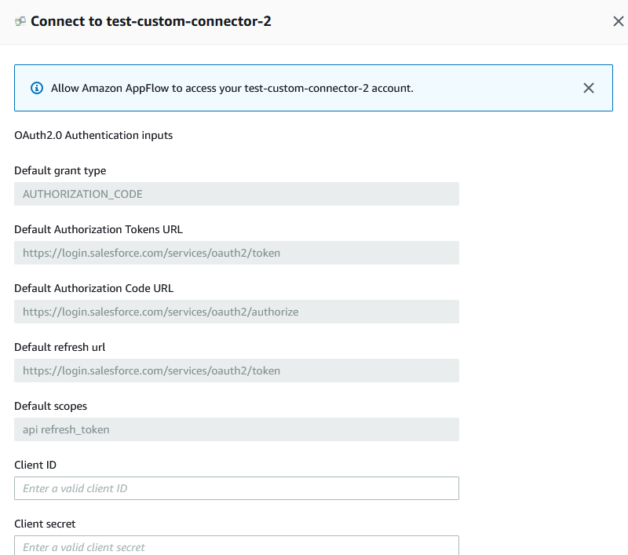
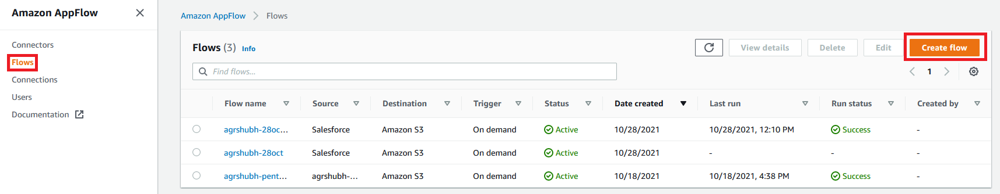
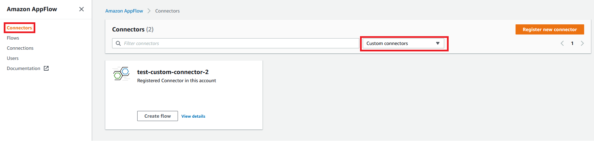

# Amazon AppFlow Custom Connector SDK Development Guide

Amazon AppFlow is a fully managed integration service that enables you to securely transfer data between Software-as-a-Service (SaaS) applications like Salesforce, SAP, Zendesk, Slack, and ServiceNow, and AWS services like Amazon S3 and Amazon Redshift, in just a few clicks. With AppFlow, you can run data flows at enterprise scale at the frequency you choose - on a schedule, in response to a business event, or on demand. You can configure data transformation capabilities like filtering and validation to generate rich, ready-to-use data as part of the flow itself, without additional steps. AppFlow automatically encrypts data in motion, and it allows users to restrict data from flowing over the public internet for SaaS applications that are integrated with AWS PrivateLink, reducing exposure to security threats. For more details about AppFlow, see https://aws.amazon.com/appflow/.

The AppFlow Custom Connector SDK enables customers and third party developers to build custom source and/or destination connectors for the AppFlow service. With the SDK, you can connect to private APIs, on-premise proprietary systems, and other cloud services by adding to AppFlow's library of connectors (https://aws.amazon.com/appflow/integrations/).   

The Amazon AppFlow Custom Connector SDK simplifies connector development through the use of a normalized interface and data model. It provides authentication, pagination, throttling, error handling, deployment scripts, and a test framework. Connectors developed with the SDK can be used privately, shared within your organization or partners, or published on AWS Marketplace (https://aws.amazon.com/marketplace).

This document is a guide for developing AppFlow custom connectors.  The SDK includes a complete working example of a sample connector in Python/Java.


## What is an AppFlow 'Connector'?
A connector translates the normalized AppFlow requests (read and write calls) to the requests compatible for the underlying application. The translation includes protocol, API format, query format, data model etc. Connectors support queries, partial queries (paginated) and write calls (insert, update, upsert and delete operations).

AppFlow transfers data between source and destination connectors using an incremental query model. It constructs a query based on the Flow configuration and uses that to pull a configurable number of records from the source connector. For subsequent runs, AppFlow pulls only the records that have changed or were created since the last run. For structured data, the queries are based on entities (e.g. Accounts, Orders, Contact, Benefit, Report etc) as declared by a given connector.

## Connector Configuration

AppFlow manages authentication information for each connector, and it makes those credentials available to the connectors with the request for data reads and writes. AppFlow depends on the connector to provide the authentication scheme(s) the connectors support and the corresponding configuration parameters. It then gives an option to the AppFlow user to pick the desired authentication scheme from the list of supported schemes for that connector. Apart from authentication configuration, connector can also declare the implementation specific runtime settings. For these settings, input from AppFlow users is required during the ConnectorProfile creation or Flow creation. AppFlow stores the user credentials in user’s security manager. The authentication credentials ARN and the runtime settings are stored along with the ConnectorProfile state, and they are passed along with every request to the connector.

## Entity Metadata

AppFlow support dynamic discovery of schema and depends on the connectors to provide the required metadata. Therefore, 
AppFlow depends on two metadata queries from the connectors: 
1. `listEntities`. This API is recursive in nature and provides a hierarchical entity listing based on entityPath. If the 
`listEntities` response has `hasChildren=true`, that that indicates that there are more entities in the next level.
2. `describeEntity`. This API provides field-level details of a given entity.
After retrieving the metadata from the connector, AppFlow caches the metadata as per the ttl value returned by the connector 
along with the metadata response in the CacheControl structure. If no ttl value is specified, AppFlow defaults to 
1 hour.
    
These APIs should be implemented in the MetadataHandler and should return metadata about the entities that are supported by the underlying application. An Entity is a standalone object that can be queried by the Public API.

AppFlow expects the MetadataResponse to contain information about the structure of any given Entity, called the EntityDefinition. At a minimum, the EntityDefinition should contain the  following fields:

1. **Entity:** Contains information about the actual entity such as EntityIdentifier, Label, Description, whether the entity is writable or has nested entities.
2. **Fields:** List of FieldDefinitions which contains information about the fields supported by this entity.


###Entity
* **entityIdentifier** - The unique id which is used to identify the entity in requests made to the service. This could be entityId/ entityName / entityPath+name / entityUrl etc...

* **hasNestedEntities** - A boolean indicating whether the entity has nested or child entities associated with it. AppFlow uses this parameter to determine whether child entities exist and should be displayed to the user for selection during flow creation.

* **isWriteable** - A boolean indicating whether the entity is writeable. This field helps AppFlow determine whether an entity supports WRITE operations. Entities that don't support WRITE operations are excluded when the given connector is used as a "destination" connector in the AppFlow Flow

* **label** - An optional string field indicating the label of the entity. If no value is provided, the identifier is displayed to the customers.

* **description** - An optional string field indicating the description of the entity. You can provide a description to give customers information about the entity.

###FieldDefinition
* **fieldName** - The unique identifier for the field. Used to identify the field in requests made to the service.

* **dataType** - The data type of this field. AppFlow supports the following data types and you must select one of these types:
```python
class FieldDataType(Enum):
    # String data type used for storing a sequence of characters. Ex. "CustomConnectorDataType".
    String = auto()
    # 32-bit signed 2's compliment integer. Range from -2^31 -> 2^31 - 1.
    Integer = auto()
    # 32-bit floating point. Holds up to 7 decimal digits.
    Float = auto()
    # 64-bit floating point number. Holds up to 16 decimal digits. Use when needing more precision than the Float.
    Double = auto()
    # 64-bit signed 2's compliment integer. Use when Integer is not large enough to hold the value.
    Long = auto()
    # 16-bit signed 2's compliment integer. Use when large values are not expected and you want to minimize payload size.
    Short = auto()
    # Used for storing very large integers that are outside the limit of Integer and Long data types.
    BigInteger = auto()
    # Used for storing very large floating point numbers that are outside the limit of Float and Double.
    BigDecimal = auto()
    # Array of bytes (8-bit signed integer). Used for storing arbitrary data in binary format.
    ByteArray = auto()
    # Boolean data type used for storing logical values (true or false).
    Boolean = auto()
    # Date format used to store dates. Use for fields that contain dates (usually formatted as ISO-8601). Ex "yyyy-MM-dd".
    # Only Date and DateTime fields can be selected for incremental pull configurations.
    Date = auto()
    # Date format used to store date with time commponent. Use for fields that contain date time (usually formatted as ISO-8601). Ex "yyyy-MM-dd'T'HH:mm:ss.SSS".
    # Only Date and DateTime fields can be selected for incremental pull configurations.
    DateTime = auto()
    # Arbitrary JSON structured data type. Use when the field value consists of structured data.
    Struct = auto()
    # Structure containing (key, value) pairs. Both keys and values must be primitive data types (otherwise use Struct).
    Map = auto()
    # List structure containing elements. Elements must be primitives.
    List = auto()
}
```

* **dataTypeLabel** - If the underlying service uses a different label (than the above listed types) for the data type of this field, you may use this to override the label that is shown to the customer. This ensures the customer will always see the data type that is used by the underlying service. For example, a service may use Array as a data type which is the same as the List data type supported by AppFlow.

* **label** - An optional string indicating the label of the field. If no value is provided, the identifier is displayed to the customers.

* **description** - An optional string field indicating the description for the field. You can provide a description to give customers information about the field.

* **defaultValue** - Specify the default value for a field that should be used in-case no value is specified in the record.

* **constraints** - Optional parameter to specify the constraints for this field such as length, min/max values, etc... Refer to the FieldConstraints class to determine how to construct these constraints: https://github.com/awslabs/aws-appflow-custom-connector-java/blob/main/custom-connector-sdk/src/main/java/com/amazonaws/appflow/custom/connector/model/metadata/FieldConstraints.java

* **readProperties** - Defines properties that are applied to the field when the connector is used as a SOURCE:
  * **isRetrievable** - Boolean indicating if the field can be used in a search result or when retrieving objects. This is similar to the ability to SELECT fields to display in SQL queries. If false, the field cannot be retrieved when using this connector as a SOURCE.
  * **isNullable** - Boolean indicating if the field can have a null value. If false and AppFlow encounters a null value during flow execution, the flow will fail because we don’t expect the source to have null.
  * **isQueryable** - Boolean indicating if the field can be used in filter queries. This is similar to the ability to specify filters in the WHERE clause of SQL queries. Some services will not allow requests to contain certain fields as queryable and in such cases, this should be set to false.
  * **isTimestampFieldForIncrementalQueries** - Boolean indicating if this field can be used for scheduled flows to pull incremental data from last successful execution time. This property indicates that the field contains timestamp values (either as Date or DateTime) which can be used by AppFlow to configure incremental data pulls. If no such field exists then scheduled flows cannot be configured to pull incremental data (all executions will result in a full data pull).


* **writeProperties** - Defines properties that are applied to the field when the connector is used as a DESTINATION:
  * **isCreateable, isUpdateable, isUpsertable** - Boolean properties indicating whether the field can be created or updated in the destination when doing WRITE operations like CREATE/UPDATE/UPSERT.
  * **isDefaultedOnCreate** - Boolean indicating if the field should use the default value while creating the record if not provided. Otherwise, null will be used if field is nullable.
  * **isNullable** - Boolean indicating if the field can have a null value when doing write operations. If false and the record being written contains null, then the flow will fail because the field value cannot be set to null.
  * **supportedWriteOperations** - List of write operations (CREATE/UPDATE/UPSERT) supported by this field. This field can only be used as a destination field when the flow destination is configured for a supported write operation.


* **customProperties** - Key, Value map that contains extra properties of the field that are not listed above.

* **[filterOperators](https://github.com/awslabs/aws-appflow-custom-connector-java/blob/main/custom-connector-sdk/src/main/java/com/amazonaws/appflow/custom/connector/model/metadata/FieldDefinition.java#L128)** - This method by default provides the filter operators that are possible for this field depending on the datatype. This is used by AppFlow to determine whether a field can be used to filter and which types of filtering is supported. The connector developer may also override this method if some dataTypes need to be allowed/disallowed for certain filter operations. 
For example, override this method if you don’t want to support CONTAINS filter operation on List dataTypes. AppFlow will then NOT send filter expression with CONTAINS for this field to your connector.


## SDK Interfaces

| Interfaces           | Description                                                                  |
|----------------------|------------------------------------------------------------------------------|
| ConfigurationHandler | Defines the functionality to be implemented for configurations, credentials related operations  |
| MetadataHandler      | Defines the functionality to be implemented for metadata operations |
| RecordHandler        | Defines the functionality to be implemented for record related CRUD operations|

In the next section, we take a closer look at these interfaces. AppFlow uses these interfaces to interact with connectors 
for fetching data from the source connector or pushing data into the destination connector. It also uses these interfaces
for the connector registration using the configuration returned by the connector and also to retrieve 
metadata dynamically. Therefore, along with the data interfaces, the connector developers are required to implement 
the interface to declare supported authentication types, configuration, and also the metadata interface 
which helps the connector declare the supported entities and their shape.

The connector developers therefore are essentially writing the wiring code to translate to/from from vendor’s API to 
the generic AppFlow custom connector interface. The connector code needs to handle the following:
- Necessary protocol and data model transformations.
- Normalization to standard error-codes.
- If the token was found to be expired, the connector can propagate the exception. Then AppFlow can handle
the exception and refresh the token and reissue the request.
- Pagination support.
- Vendors specific versioning differences.

## ConfigurationHandler Details

Allows the connector to declare connector runtime settings and authentication config etc using the 
describeConnectorConfiguration method. 

It also includes the implementation for the following callbacks:
1. validateConnectorRuntimeSettings: to validate user input for connector runtime settings.
2. validateCredentials: to validate user credentials entered by the AppFlow user.      
```python
class ConfigurationHandler(metaclass=abc.ABCMeta):
    """This abstract base class defines the functionality to be implemented by custom connectors for configurations,
    credentials related operations.
    """
    @abc.abstractmethod
    def describe_connector_configuration(self, request: requests.DescribeConnectorConfigurationRequest) -> \
            responses.DescribeConnectorConfigurationResponse:
        """Describes the Connector Configuration supported by the connector.

        Parameters:
        request (DescribeConnectorConfigurationRequest)

        Return:
        DescribeConnectorConfigurationResponse
        """
        pass
    
    @abc.abstractmethod
    def validate_connector_runtime_settings(self, request: requests.ValidateConnectorRuntimeSettingsRequest) -> \
            responses.ValidateConnectorRuntimeSettingsResponse:
        """Validates the user inputs corresponding to the connector settings for a given ConnectorRuntimeSettingScope

        Parameters:
        request (ValidateConnectorRuntimeSettingsRequest)

        Return:
        ValidateConnectorRuntimeSettingsResponse
        """
        pass

    @abc.abstractmethod
    def validate_credentials(self, request: requests.ValidateCredentialsRequest) -> \
            responses.ValidateCredentialsResponse:
        """Validates the user provided credentials.

        Parameters:
        request (ValidateCredentialsRequest)

        Return:
        ValidateCredentialsResponse
        """
        pass

```

## MetadataHandler Details

Allows the connector to declare the entity metadata for the underlying application
- listEntities
- describeEntity
```python
class MetadataHandler(metaclass=abc.ABCMeta):
    """This abstract base class defines the functionality to be implemented by custom connectors for metadata
    operations.
    """
    @abc.abstractmethod
    def list_entities(self, request: requests.ListEntitiesRequest) -> responses.ListEntitiesResponse:
        """Lists all the entities available in a paginated fashion. This API is recursive in nature
        and provides a heretical entity listing based on entityPath. If the ListEntitiesResponse
        returns has_children=true, that indicates that there are more entities in the next level.

        Parameters:
        request (ListEntitiesRequest)

        Return:
        ListEntitiesResponse
        """
        pass

    @abc.abstractmethod
    def describe_entity(self, request: requests.DescribeEntityRequest) -> responses.DescribeEntityResponse:
        """Describes the entity definition with its field level metadata.
        
        Parameters:
        request (DescribeEntityRequest)

        Return:
        DescribeEntityResponse
        """
        pass

```

## RecordHandler Details

This is where the main functionality of data exchange is implemented:
- retrieveData: lookup records against a batch of ids
- queryData: queries the underlying application by translating the incoming filterExpress that follows a specific
AppFlow DSL (SDK contains a parser to help parse the filterExpression)
- writeData: writes a batch of records to the underlying application
```python
class RecordHandler(metaclass=abc.ABCMeta):
    """This abstract base class defines the functionality to be implemented by custom connectors for record related
    operations.
    """
    @abc.abstractmethod
    def retrieve_data(self, request: requests.RetrieveDataRequest) -> responses.RetrieveDataResponse:
        """Retrieves the batch of records against a set of identifiers from the source application.

        Parameters:
        request (RetrieveDataRequest)

        Return:
        RetrieveDataResponse
        """
        pass

    @abc.abstractmethod
    def query_data(self, request: requests.QueryDataRequest) -> responses.QueryDataResponse:
        """Writes batch of records to the destination application.

        Parameters:
        request (QueryDataResponse)

        Return:
        WriteDataResponse
        """
        pass

    @abc.abstractmethod
    def write_data(self, request: requests.WriteDataRequest) -> responses.WriteDataResponse:
        """Writes batch of records to the destination application.

        Parameters:
        request (WriteDataRequest)

        Return:
        WriteDataResponse
        """
        pass

```

## Filter Expression DSL and Parser

AppFlow uses an incremental query model to fetch data from the source. The initial pull queries records modified/created in 
the past 30 days (configurable). In the next flow execution onwards, it runs incremental queries to pull data modified/created since the 
last execution. The AppFlow query engine takes the user input for filtering from the flow definition and translates it to 
a normalized DSL and passes it on to connectors. Connectors then take that normalized expression and translate it to 
application-specific format. The domain specific language (DSL) that defines the filter expressions grammar is AppFlow 
specific. For example: “price > 100 and accountName contains 'Alexa'". The query expression DSL is a normalized DSL 
and not specific to DSLs used by specific underlying applications. The connector's job is to provide the necessary 
translation from AppFlow DSL to application-specific DSL or other syntax the underlying application requires. In order 
to simplify the work needed to parse the filter expression the parser has been included. Please see the README.md under
the `custom_connector_queryfilter` module for the details.

## AppFlow Custom Connector – End-to-End Flow

The following is a sample end-to-end processing flow to help understand how AppFlow interacts with the custom connectors using
the above interfaces:

- Step 1: Connector implementation declares the supported authentication types using the ConfigurationHandler class.
AppFlow uses `describeConnectorConfiguration` function to retrieve the connector configuration. The
`DescribeConnectorConfigurationResponse` includes `AuthenticationConfig` and `ConnectorRuntimeSettings` data structures.
AuthenticationConfig defines the auth scheme supported by the connector (OAuth2/BASIC etc) and
ConnectorRuntimeSettings represents the setting that the connector needs at runtime, input for which are provided by
the AppFlow user.(e.g. timeout values or any other implementation dependent inputs)

- Step 2: AppFlow customer deploys this connector Lambda stack into their account and registers a `Connector` against the
Lambda using the `register_connector` AppFlow public API.

- Step 3: AppFlow customer creates a new `ConnectorProfile` against this newly registered connector and picks an
authentication type (for this example, let’s assume they picked OAuth2)

- Step 4: AppFlow Console presents them with the corresponding authentication flow and AppFlow takes user inputs and
invokes `validateCredentials` function on the connector. If that succeeds, the console presents the screen to take user input for
the "connector runtime settings" declared by the connector. When user inputs the values corresponding to the settings (example: 
var1=10, var2=“Foo”). AppFlow invokes `validateConnectorRuntimeSettings` function on the connector so that it can validate the
user input. Upon successful validation the credentials and connector runtime settings are stored along with the newly created
`ConnectorProfile`.

- Step 5: AppFlow user then uses that `ConnectorProfile` to create `Flow` definitions. During the flow creation AppFlow
invokes `listEntity` and `describeEntity` functions on the connector to retrieve the list of supported entities and the entity
detail of the specific entity AppFlow user selected on the console / API.

- Step 6: When the flow is started AppFlow invokes the connector to execute the query constructed using the user input
during the AppFlow definition using the `queryData` function.

- Step 7: For incremental flows AppFlow adds the timestamp based filter on the query and passes it on the connector to
invoke it again for incremental data pulls using the query_data function. 

- Step 8: If the destination connector is also a custom connector, AppFlow processes the incoming records as per the
task definitions and prepares the payload as per the entity shape of the destination connector and hands it over to the
destination connector by invoking the `writeData` function.


## Connector Developer Experience

- Clone the `custom-connector-example` module and modify the implementation to fit the underlying application you are 
writing the connector for.
- Edit the implementations for the three lambda handlers: `ConfigurationHandler`, `MetadataHandler` and `RecordHandler`.
- Add unit tests.
- This SDK productivity scripts under the `custom-connector-tools` module, to help build and export the package into 
S3 using AWS CloudFormation template and then deploy the Lambda stack into your account.
- Login into the AppFlow console and register a `Connector` against the new Lambda.
- Create a `ConnectorProfile` against the newly registered `Connector`.
- Create a flow using the new `Connector` and `ConnectorProfile`.
- Execute the flow.


## Getting Started Guide

### Documentation

The Amazon AppFlow documentation is located here: https://docs.aws.amazon.com/appflow/index.html. The API reference guide can be found here: https://docs.aws.amazon.com/appflow/1.0/APIReference/API_Operations.html.

### Downloading the SDK


The Amazon AppFlow Custom Connector SDK is available for both Java and Python on github at the following link: https://github.com/orgs/awslabs/repositories?q=aws-appflow-custom-connector-

* Java SDK - You can find the Java SDK in [AppFlowJavaSdk](https://github.com/awslabs/aws-appflow-custom-connector-java)/
* Python SDK - You can find the Python SDK .whl file in [AppFlowPythonSDK/](https://github.com/awslabs/aws-appflow-custom-connector-python)

### Using the SDK

#### For Java SDK Users:

Once you have the jar, create the Amazon AppFlow client instance and invoke the AppFlow APIs.

```
AmazonAppflow appflowClient = AmazonAppflowClientBuilder.standard()
       .withRegion(region)
        .build();
```

#### For Python Users:

Once you have the python whl file, install the whl files using pip3 install. Create the AppFlow client using the boto3 and call the AppFlow APIs.

**Commands to install the Python SDK:**

```
python3 -m pip install botocore-1.21.25-py3-none-any.whl
python3 -m pip install boto3-1.18.25-py3-none-any.whl
```

```
import boto3

appflowClient = boto3.client('appflow')
```

### Lambda Permissions and Resource Policy Must be Manually Updated

In order for AppFlow to invoke the custom connector Lambda function while executing customer flows, the following permissions need to be added manually (or by simply using the `deploy.sh` script provided in the custom-connector-tools package):

```
{
    "Version": "*2012-10-17*",
    "Id": "default",
    "Statement": [{
        "Sid": "*appflow-example-01*",
        "Effect": "Allow",
        "Principal": {
            "Service": "appflow.amazonaws.com"
        },
        "Action": "lambda:InvokeFunction",
        "Resource": "arn:aws:lambda:*us-east-1*:123456789012:function:*my-function*",
        "Condition": {
            "StringEquals": {
                "AWS:SourceAccount": "*123456789012*"
            },
            "ArnLike": {
                "AWS:SourceArn": "arn:aws:appflow:*us-east-1*:*123456789012*:*"
            }
        }
    }]
}
```

* source account: the customers account 
* source arn: all of the Amazon AppFlow resources present in the customers account

The Source Account and the Source ARN condition helps to prevent the “confused deputy” security vulnerability. The allow-listed service principal allows all of the AWS accounts under the “appflow” service principal to access the customer Lambda.

### Registering your Custom Connector

#### For Console Users:

i) Go to the Amazon AppFlow console and select “Connectors” on the left-side menu. 

 

ii) Click on the “Register New Connector” button on the console.

 

iii) Your custom connector Lambda function will be available on this webpage. If not, ensure that the appropriate Lambda permissions are set, as described in the section “Updating Lambda Permissions and Resource Policy Required."



iv) Provide the label for your connector. The label must be unique per account per region. Click on the “Register” button. 



v) Once registered, you’ll see the connector in the list of custom connectors.



#### For API  Users:

Invoke the `registerConnector` public API endpoint with the following request payload:

```
{
   "connectorLabel":"TestCustomConnector", [The unique Label]
   "connectorProvisioningType":"LAMBDA",   [The provisioning type of the connector.
    Currently only supported value is LAMBDA]
   "connectorProvisioningConfig":{
      "lambda":{
         "lambdaArn":"arn:aws:lambda:us-west-2:364320160620:function: 
         banvipulCustomConnectorBugBash" [The arn of the deployed lambda]
      }
   }
}
```


### Creating the Connector Profile

#### For Console Users:

i) Go to the “Connections” link from the left menu and select the registered connector from the list.



ii) Once selected click on the ‘Create Connection’ button.



iii) A pop-up appears asking for the required details to create a connection. Please fill in the details and scroll down to click on the ‘Continue’ button. 



iv) Your connection now appears in the list.

#### For API Users:

For custom connectors, a new parameter has been added in the request object for this API. 

```
{
   .............................
   .............................
   .............................
   "connectorLabel":"TestCustomConnector", [The Label provided while registering the 
   connector]
   .............................
   .............................
   .............................
}
```

Please follow the sample API request here https://docs.aws.amazon.com/appflow/1.0/APIReference/API_CreateConnectorProfile.html 

### Creating Flows

#### For Console Users:

i) Click on the Flow tab in the left menu, select Create Flow, then follow the standard AppFlow flow configuration steps.  



#### For API Users:

Follow the sample API request here:
https://docs.aws.amazon.com/appflow/1.0/APIReference/API_CreateFlow.html

In addition to this, for the custom connectors we have added the following parameters in the request object for this API:

### Finding and Listing Custom Connectors

#### For Console Users:

Go the Amazon AppFlow console and click on “Connectors” on the left menu. Select “Custom connectors” in the drop down list.



#### For API Users:

Call the listConnectors API with the following request format, this will list all the custom connectors registered in your account:

```
{
  "maxResults" : 100 // default is 20 and accepted values are between 1 to 100.
}
```

### Obtaining Details about the Registered Connector

#### For Console Users:

Go the Amazon AppFlow console, click on “Connectors” on the left menu, then click “View details” on the connector of interest. 


#### For API Users:

Please call describeConnector API. Please follow the sample API request here:

```
{
  "connectorType" : `"CustomConnector",
  "connectorLabel": <YourConnectorLabel>`
}
```

## Testing the connector

### Using AWS Lambda console

* After your connector is deployed, you can access the connector through the AWS Lambda console.
* You can go to the test tab, and define the payloads as per the request format and then invoke the Lambda to test this.
* To the request payload, you can build the request using the Request model defined as SDK and then convert it to JSON string and then use that on console.
* You can also use our Testing Tools in `custom-connector-tests` and `custom-connector-integ-test` to test your connector.

## Additional details:

Please refer to the below READMEs to learn more about the SDK:
- You can find QueryFilter README in `custom-connector-queryfilter`
- You can find Example README in `custom-connector-example`
- You can find Deployment Tools README in `custom-connector-tools`
- You can find Testing Tools README in `custom-connector-tests` and `custom-connector-integ-test`
